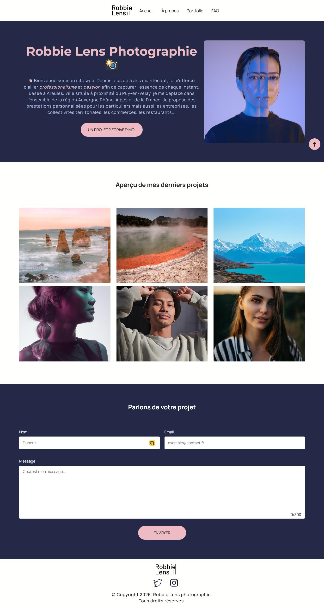
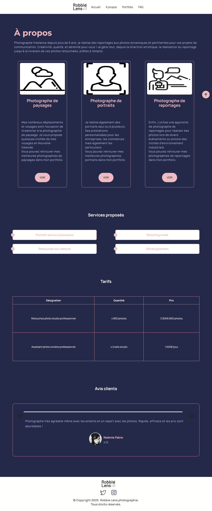
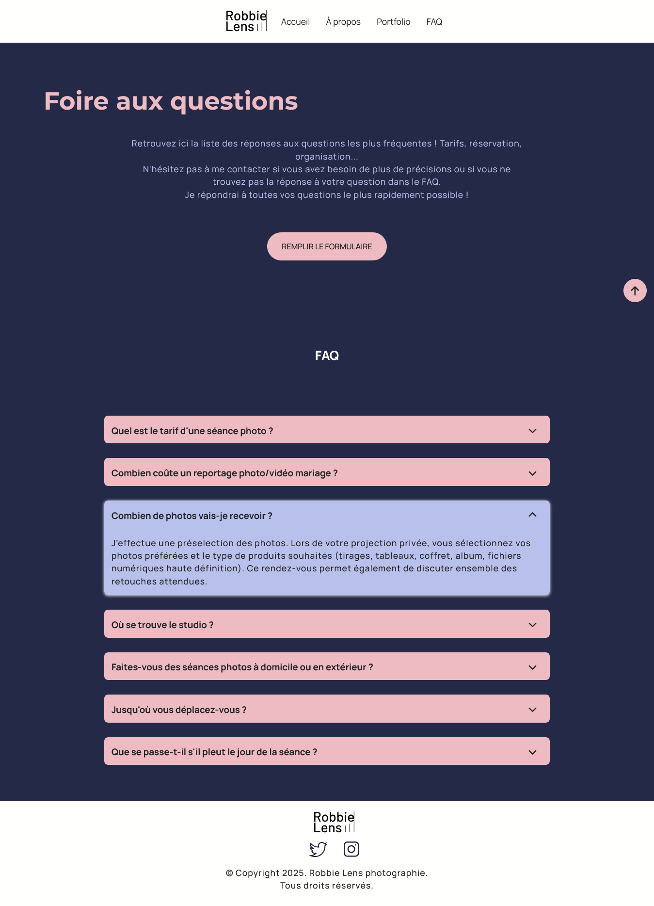

## ROBBIE LENS PHOTGRAPHIE 📸 SITE COMPLET EN HTML5 CSS3 ET JAVASCRIPT

## Le challenge

Création d'un simple complet responsive et dynamique ROBBIE LENS PHOTGRAPHIE en HTML5, CSS3 et JavaScript. Ce site comprend quatre pages :

- la page Accueil
- la page A propos
- la page Portfolio
- et la page FAQ

La redirection vers les différentes pages du site web s'effectue au clic sur les liens présents dans la navigation.

## Démonstration

Lien vers le projet : https://aperbet56.github.io/robbie_lens_photograph/

## Projet développé avec

- Utilisation des balises sémantiques HTML5
- CSS3
- Flexbox
- Utilsation d'un normaliseur : le fichier normalize.css
- Importation des polices "Montserrat" et "Manrope"
- Animations CSS
- Création d'un loader pour la page portfolio
- Page web responsive
- Desktop first
- JavaScript (fonctions fléchées, écouteurs d'événement, création et ajout d'élément HTML dans le DOM...)
- Code JavaScript commenté
- Regex
- Menu rideau pour la navigation en version mobile
